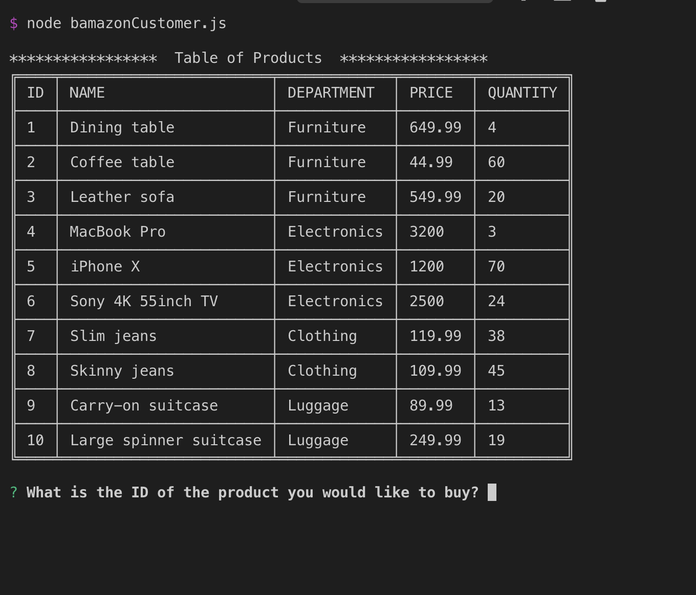

# :link: Me on GitHub
* My [profile](https://github.com/Arsalan-Sadri)
  * All repositories, source codes, READMEs, pull requests, commits, issues, and...
* My [portfolio](https://Arsalan-Sadri.github.io)
  * Find all deployed applications 

# :page_with_curl: Description
* A Node.js console application simulating an inventory of miscellaneous items.
* Items are stred in MySQL database and illustrated in a table to customers and managers (a screenshot given below).
* Inventory can be updated and items can be added to and removed from database through command line (console).

* 2 functionalities:
  * If you wish to see it as a customer: `bamazonCustomer.js`
  * If you wish to see it as a manager: `bamazonManager.js`

# :nut_and_bolt: Tools and Technologies
* Editor: `Visual Studio Code`
* Languages: `(vanilla) JavaScript`
* DB Server: `MySQL`
* Runtime Environment: `Node.js`
* Package Manager: `npm`
* Modules: `inquirer`, `mysql`, `table`

# :arrow_forward: Application Deployed
* See the [application]() up and running via GitHub Pages directly from its depository. 

# :tv: Demo
* [Here](https://youtu.be/jGRjsO4kqg4) see a short demo of this application on my YouTube channel!

# :wrench: How to Run
1. **Clone down** the application to your local device.
2. **Install the packages** specified in `package.json`.
3. Get your **database** up and running.
   1. Start MySQL server
      * On Mac: Open **Spotlight Search**, type in **mysql**, then choose **mysql.prefPane**,
       enter your password, and finally hit **Start MySQL Server**
   2. Create schema using `schema.sql`
   3. Add data to your database using `seeds.sql`
   4. Modify port, user, and password in the corresponding `.js` to reflect your credential.
4. Open **terminal** (on mac)
5. **run** `$ node bamazonCustomer.js` or `$ node bamazonManager.js`, depending on what you wish to do.
6. **Follow instructions** on the console.
